# HOME

- [INTRODUCTION](#introduction)

- [GET STARTED](#get-started)
  - [NORMAL USER](#start-as-a-normal-user)
  - [DEVELOPER](#start-as-a-project-developer)
  - [SELLER and RESELLER](#start-as-a-project-seller-or-minibot-reseller)

- [DEVELOPMENT GUIDE](#development-guide)
  - [FRAMEWORK CONCEPTS](#framework-concepts)
    - [PROJECT](#project)
    - [PATH GROUP](#path-group)
    - [NEXT PATH GROUP](#next-path-group)
    - [PATH](#path)
    - [CORPSE PATH](#corpse-path)
    - [WAYPOINT](#waypoint)
    - [RENDEZVOUS](#rendezvous)
    - [WAYPOINT ACTION](#waypoint-action)
    - [COMMON PROPERTY](#common-property)
    - [GLOBAL ACTION](#global-action)
    - [CONDITION and VARIABLE](#condition-and-variable)
    - [CUSTOM SCRIPT](#custom-script)
    - [NAVIGATION STATES](#navigation-states)
  - [YOUR FIRST SIMPLE GRIND PROJECT](#your-first-simple-grind-project)
    - [START MINIBOT STUDIO](#start-minibot-studio)
    - [CREATE NEW PROJECT](#create-new-project)
    - [DESIGN PROJECT TOPOLOGY](#design-project-topology)
    - [CREATE PATH GROUPS](#create-path-groups)
    - [RECORD PATHS](#record-paths)
    - [ASSIGN PATHS TO PATH GROUPS](#assign-paths-to-path-groups)
    - [CONFIGURE RENDEZVOUS](#configure-rendezvous)
    - [ADD COMMON PROPERTIES](#add-common-properties)
    - [ADD WAYPOINT ACTIONS](#add-common-properties)
    - [FINALIZE &amp; PUBLISH](#finalize--publish)
  - [BUILD YOUR OWN FRAMEWORK &amp; ADDON](#build-your-own-framework--addon)
    - [UNLOCK PROTECTED WOW API](#unlock-protected-wow-api)
    - [UNIVERSAL OBJECT ID](#universal-object-id)
    - [CUSTOM API](#custom-api)
    - [FRAMEWORK-INDEPENDENT PROJECT](#framework-independent-project)
-----------------------------

# INTRODUCTION

**MiniBot for WoW** is an easy-to-use, advanced, one-stop and subscription-based platform for developing, releasing and running WoW bot projects. It brings lots of revolutionary features while you don’t need anything else to get all the bot magics to become true!

The whole **MiniBot** has many innovative features. To name just a few, we will highlight only the most important and revolutionary ones here.

## Proprietary Kernel

No, we are not a pixel-based bot (proven to be unstable, low quality and even not 100% safe). Yes, we eat our own lunch by using our own memory-based kernel. It runs in Windows kernel mode utilizing virtualization technology (ring -1) while Warden (WoW anti-cheat) only runs in Windows user mode (ring 3). This is like a V16, the most powerful engine of a car on earth.

## Dual-Version Support

**MiniBot** supports both Retail and Classic version of WoW (only official servers).

## Official Lua-based Framework

The existing “WoW unlockers” in the market only provide a bare-metal engine and let 3rd party developers write Lua addons from ground up. Such developers have very little knowledge about how unlockers work under the hood. We believe this is wrong as it leads to high cost of development, lots of fragmentation, unreliability, and most importantly lack of safety. Besides, the end users can easily encounter passing-the-buck issues under this structure.

Thus, besides our own kernel, MiniBot also brings a well-encapsulated framework developed by the same team who invented the kernel. It establishes the standards of WoW bot development in the following terms.

## Navmesh-Driven
Obviously, the framework is based on Navmesh to achieve the most human-like navigation. Besides, it never uses Click-To-Move (the notorious yellow circle on the ground) but simulates every movement action like how 99% users usually play via keyboard.

## Code-Free Bot Development

**MiniBot** eliminates the necessity of coding Lua if you wish to build a normal bot product by providing a GUI-based tool called “MiniBot Studio”. Yes, you only need to have a structured timeline-based idea in your mind without any programming skills, just like directing a movie! Then, you can build your own highly-customized bot projects within a couple of hours just like how you use Excel or Adobe Premiere.

## Programmable Extensions

Though you don’t need to code Lua, but you still can if you wish to customize stuffs not provided by the official vocabulary. The Framework gives you several extension points where you can write your own Lua scripts. Such design still gives you great flexibility of extent that you wish to customize the stuffs.

If you are still not satisfied with the framework extension points, you can even create your own new Lua framework just like what the other unlockers can ONLY do, while it can still be commercially protected by the following feature.

## Commercial-Ready Projects

**MiniBot** puts the commercialization of Bot project development in top priority. Therefore, it allows you to create encrypted copies of your own project with full authorization control with only a simple command line tool. By only dispatching such protected copies to other users, you can rest assured that your own project work is fully copyright protected and commercially ready.

## OEM Friendly

Though **MiniBot** is a paid platform, we are still OEM friendly (aka white labeling). You can easily establish your own brand based on **MiniBot** technology. The CLI version (command-line) of **MiniBot** gives you a single command line (CLI) to build an OEM version of **MiniBot**, within a couple of minutes!

Besides, as **MiniBot CLI** can launch in “silent mode”, you could also choose the hard but more customized way to do OEM by building your own software.

## Low Cost

A fortified kernel with revolutionary framework only requires a small amount of donation for subscription. Don’t forget that you only need to subscribe once in one place, and you get everything needed! We only ask for monthly subscriptions at maximum. And if you are only casual users, the trials are also available **FOR FREE** (limited time for now). Moreover, the dual version support is included in one single subscription so you don’t have to subscribe extra to Retail and Classic versions separately!

[Back to Top](#home)

# GET STARTED

In this section, we will guide you onboard the world of MiniBot in brief words.

## Start as a Normal User

As a normal Bot user, the steps to get onboard are within a couple of minutes.

- Due to the kernel technology, make sure you are using one of the following compatible Windows OS.
  - Windows 7 SP1 with latest patch (6.1.7600.24384 or higher)
  - Windows 8.1 with latest patch (6.3.9600.19678 or higher)
  - Windows 10 with latest patch (1809 or higher)

  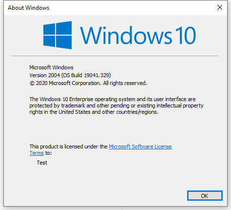

- Make sure your PC meets the minimum hardware requirement.
  - For Intel users, your CPU must be Core Ivy Bridge (3rd generation) or later.
  - For AMD users, your CPU must be Ryzen series.

- Make sure virtualization is enabled correctly in your PC BIOS setting, verified by [Leomoon CPU-V](#https://leomoon.com/downloads/desktop-apps/leomoon-cpu-v/).

- Make sure NO protection software is running, including anti-virus such as Windows Defender and other anti-cheat platforms such as FaceIt and Vanguard.

- Download the latest GUI version of **MiniBot** (`MiniBot.WoW.zip`) in [Releases](https://github.com/pierre-picard/minibot-wow/releases/latest).

- Download the latest map pack (`MiniBot.Maps.zip`) in [Releases](https://github.com/pierre-picard/minibot-wow/releases/latest) and extract it into the main folder of **MiniBot** (`/maps` subfolder).

- Start **MiniBot**, register a new user and login. (Notice your **MiniBot** user is bound to your HWID upon login, and you need to spend credits for a switch should you login from a different PC in future)

  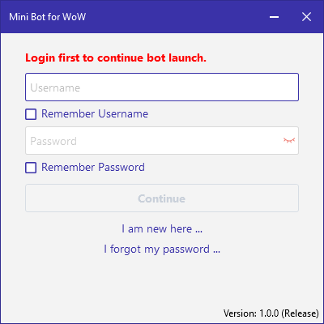

- Subscribe to **MiniBot** with a recharge card of the right value corresponding to your selected option.

  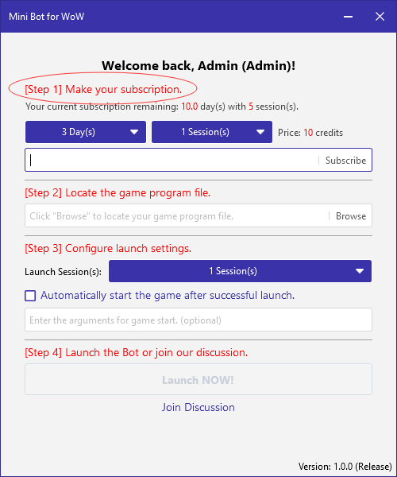

- Grab one or more **MiniBot** projects (ending with .bot files) and put them in `/scripts` subfolder.

  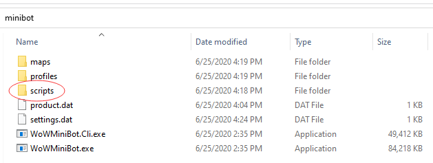

- Configure the launch options, launch the system, and enter WoW. (Notice that you can only launch one of the two WoW versions at the same time)

  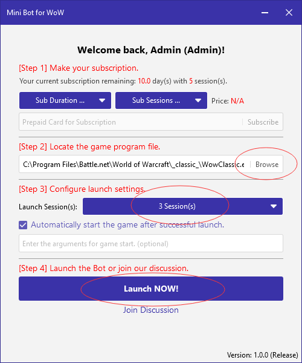

- If everything goes right, you should see the in-game **MiniBot** panel. Choose the current project that you wish to run and click `Start` button. Remember to follow the other instructions of the project developer and happy botting!

  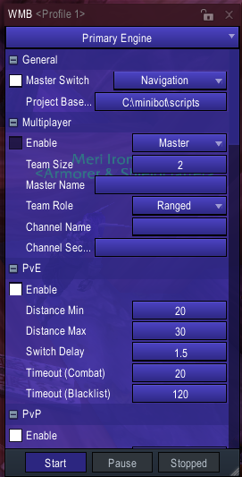
  
[Back to Top](#home)

## Start as a Project Developer

If you wish to create your own MiniBot projects, the steps to get started are also only a few as below.

- Download the latest `MiniBot Studio` (`MiniBot.Studio.zip`) in [Releases](https://github.com/pierre-picard/minibot-wow/releases/latest).

- Make sure you have the latest version of .NET Framework installed. If not, download it from [Microsoft](https://dotnet.microsoft.com/download/dotnet-framework) website.

- Start `MiniBot Studio` and choose a base folder (usually `MiniBot\scripts`) that stores your projects to develop. Each project will be a subfolder in it.

  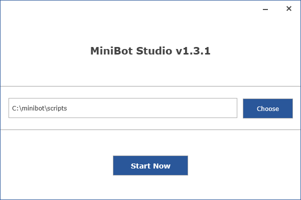

- Create a new project or load an existing one from the menu.

  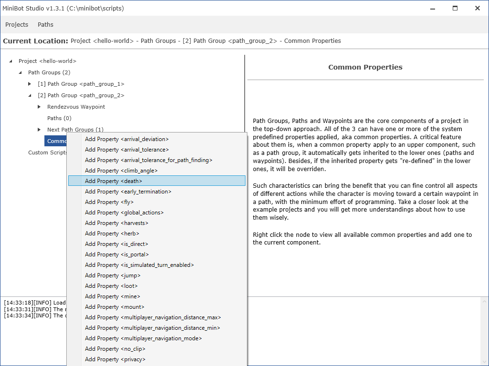

- Launch **MiniBot** and switch to the current project being developed, then record the new paths.

- Restart `MiniBot Studio` when you finish recording new paths in order to use them for project development.

- Refer to our [Development Guide](#development-guide) for all the fundamentals about developing a MiniBot project.

[Back to Top](#home)

## Start as a Project Seller or MiniBot Reseller

If you wish to sell your project work or even want to white label the product to run your own business, welcome to use `MiniBot CLI`.

- Download the latest CLI version of **MiniBot** (`MiniBot.WoW.CLI.zip`) in [Releases](https://github.com/pierre-picard/minibot-wow/releases/latest).

- Download the latest map pack (`MiniBot.Maps.zip`) in [Releases](https://github.com/pierre-picard/minibot-wow/releases/latest) and extract it into the main folder of **MiniBot** (`/maps` subfolder).

- Enter command `MiniBot.Cli.exe -h` to view all verbs of MiniBot command line.

- You can use command `MiniBot.Cli.exe inject` to launch the system in one go.

- You can use command `MiniBot.Cli.exe encrypt` to encrypt the source code of project with built-in authorizations and dispatch the protected copy to your end users.
  - Such command needs an [auth.json](cli/auth.json) definition file that contains the authorization info.

- You can use command `MiniBot.Cli.exe oem` to build an OEM file (`product.dat`) to replace the original file.
  - Such command requires Dealer access granted to your MiniBot account. Contact us for access request.
  - Such command needs an [oem.json](cli/oem.json) definition file that describes the OEM info.

[Back to Top](#home)

# DEVELOPMENT GUIDE

In this chapter, we are going to walk you through all the basics about developing a MiniBot project under its framework.

## FRAMEWORK CONCEPTS

As the beginning to WoW bot development under MiniBot framework, here lists all the major building blocks/concepts. This is necessary before you can start playing around with MiniBot Studio and the in-game panel. Do not feel overwhelmed by the abstract concepts, because you will get all the application examples explained in later sections of the chapter.

### PROJECT

`Project` is the topmost organizational unit of a Bot. At any time of a WoW session, you can only choose one project running. Before creating a new Bot project, you need to specify the base folder that contains the project, located at `MiniBot\scripts` by default, and configurable at the in-game panel. Then, in the base folder, a project subfolder is created containing all the project source files. Notice that the subfolder name is also the project name shown in both in-game panel and MiniBot Studio.

`Project` follows a hierachical structure (tree), consisting of several [Path Groups](#path-group) and [Custom Scripts](#custom-scripts). The following sections will cover both along with their own subsidiaries.

[Back to Top](#home)

### PATH GROUP

`Path Group` is the container of navigation [Paths](#path). Practically, developers should organize paths that serve the same purpose or physically reside in the same zone into a single `Path Group`.

Think the running of a MiniBot project as an interactive movie, in which the character is always running along one and only one path in a path group. As the project developer, you are just like a movie director recording the paths as cut scenes, and then organize them into path groups followed by the post-processings on the path segments ([Waypoints](#waypoint)) needed.

The only minor difference here, is that you need to create the `Path Group` in `MiniBot Studio` first before you can record the [Paths](#path). Just right click the `Path Groups` node under the `Project` root node, and choose `Create Path Group`. Then, go back to WoW and type `/reload` to see the updated path groups under the "State" category.

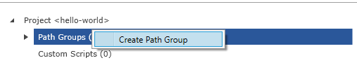
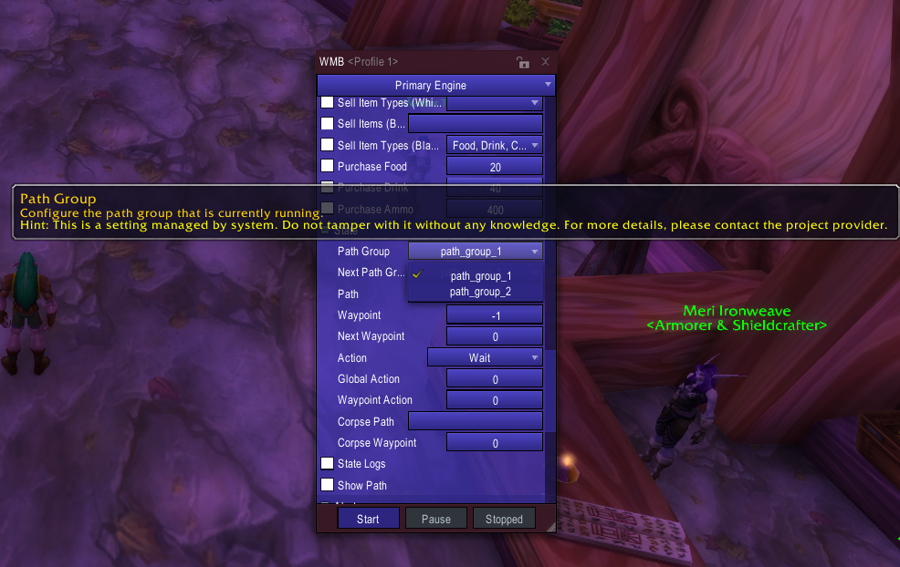

At the first running, the MiniBot Framework engine picks up the first [Path Group](#path-group) listed in the [Project](#project). You can also change the current [Path Group](#path-group) by configuring the `Path Group` shown above. Then, it is always the first [Path](#path) of the [Path Group](#path-group) to be picked up as the current one the character will run on.

[Back to Top](#home)

### NEXT PATH GROUP

Upon termination of the any [Path](#path) within the [Path Group](#path-group), the Framework will look at a bunch of `Next Path Groups` of the current [Path Group](#path-group), which define the transitions to other [Path Groups](#path-group). If the condition of any `Next Path Groups` is met, the corresponding [Path Group](#path-group) will be switched over as the current one.

Such transition can optionally include a "transitioning path" that leads to the next [Path Group](#path-group). In order to add a `Next Path Group`, just right click `Next Path Groups` under a specific [Path Group](#path-group) node, and choose `Create Next Path Group`.

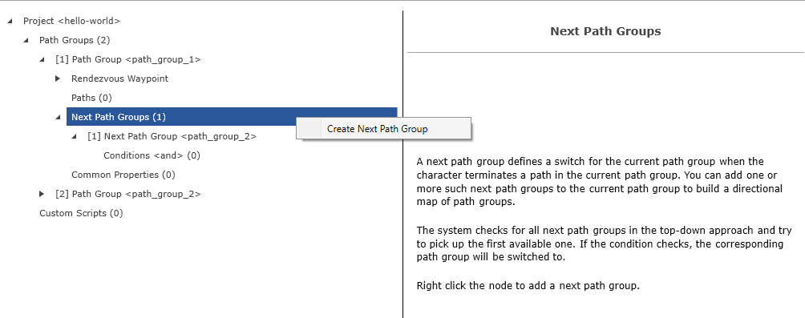

[Back to Top](#home)

### PATH

`Path` is the virtual unit containing a sequence of [Waypoints](#waypoint). By default, the character runs from the first waypoint to the last where the path is "terminated". The entire navigation logics have been partially discussed among the above sections, but we will summarize them here as below.

- When the Bot is started, the current [Path Group](#path-group) is confirmed according to the "State" configurations on panel.
- The first `Path` in the current [Path Group](#path-group) is selected as the current one the character runs on.
- When the current `Path` is terminated, inspect each [Next Path Group](#next-path-group) defined in the current [Path Group](#path-group).
- If any one checks out:
  - If "transitioning path" is defined, it will be picked up as the current [Path](#path).
  - Otherwise or if the "transitioning path" is terminated, the current [Path Group](#path-group) is switched over to the one defined in the [Next Path Group](#next-path-group) and the current `Path` is changed to the first `Path` of the new [Path Group](#path-group).
- If none checks out:
  - A random path in the current [Path Group](#path-group) is picked up as the current one the character runs on.

In order to create a path, you need to switch to WoW and create relevant recording macros, listed on the bottom of the panel (`Recording` category). Further hands-on guide about recording paths will be given in later chapters. When the paths are recorded, you need to restart `MiniBot Studio` to get them ready for further project editing.

You can add the newly recorded `Path` to a [Path Group](#path-group) by right clicking "Paths - Add Path". Further modifications to the existing paths can be fully done without in-game operations, by just clicking menu `Paths` and choose the path you wish to edit.

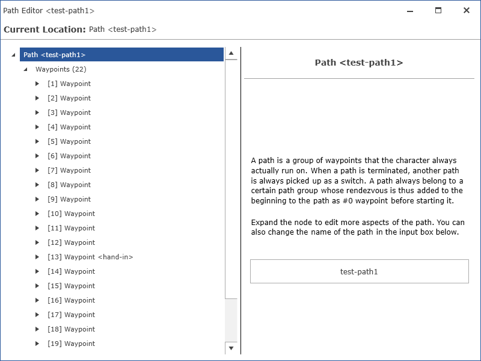

[Back to Top](#home)

### CORPSE PATH

The framework allows you to define death handling in terms of specifying an optional path to retrieve your corpse. When a `Corpse Path` is specified, the spirit will be released first followed by running along the `Corpse Path`. The corpse position will be added to the end of the path dynamically by the framework to ensure the reach of the corpse. Consider it an "auxilary path" to retrieve corpse to avoid getting stuck. If such path is not specified, the character will directly navigate to the corpse.

Notice that navigating to the corpse is a "sub-process" of normal navigation. It is triggered at any time when the character dies and will not interfere the general navigation states. Sometimes the corpse position does not exist or unpredictable. But don't worry, the framework will automatically terminate the sub-process when the character becomes alive anyhow (such as in dungeons or battlegrounds).

You can specify `Corpse Path` on any granularity ([Path Group](#path-group), [Path](#path) or [Waypoint](#waypoint)) via its [Common Property](#common-property). More examples will be given in following chapters.

[Back to Top](#home)

### WAYPOINT

`Waypoint` is the atomic navigation unit of a [Project](#project). When a character moves along a [Path](#path) in a [Path Group](#path-group), it is essentially walking from one world position to the next one, aka `Waypoint`. Once the last one is hit, the current path is terminated and switching logics take place as discussed above.

You can alter the waypoints once you have recorded path. Just go to the path editor, and right click the waypoint to bring up the context menu.

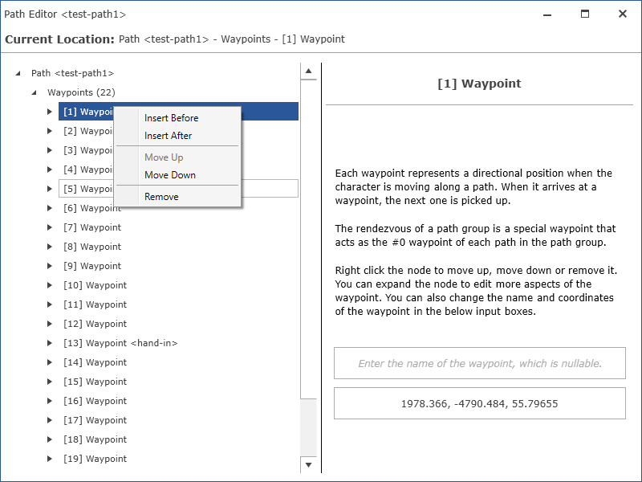

[Back to Top](#home)

### RENDEZVOUS

When you record a path, the waypoints are indexed from 1 to N. However, when the path gets run, an additional waypoint is added by the Framework engine at index 0, called Rendezvous, which is defined in each [Path Group](#path-group). In other words, all [Paths](#path) in the same [Path Group](#path-group) share the common Rendezvous, including the transitioning paths in all [Next Path Groups](#next-path-group).

The purpose of Rendezvous is to ensure that all [Paths](#path) in the same [Path Group](#path-group) sits close to each other geographically. To specify the co-ordinate of a Rendezvous, choose the [Path Group](#path-group), click "Rendezvous Waypoint", and then enter the value on the right-hand side.

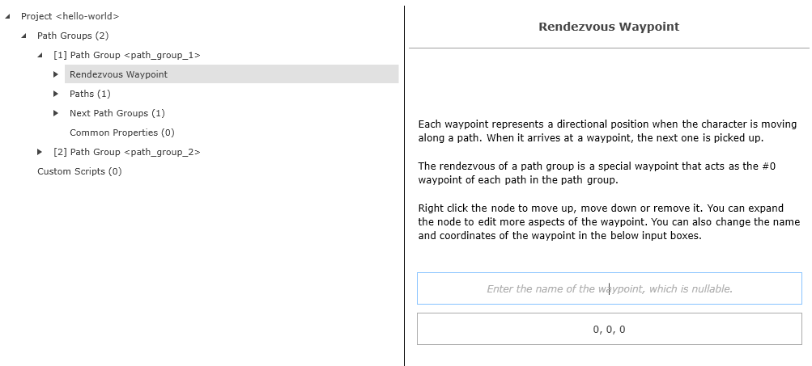

[Back to Top](#home)

### WAYPOINT ACTION

`Waypoint Actions` are a sequence of actions to be specified upon character arriving at a [Waypoint](#waypoint). Such action is like a function executed every game frame, with a return boolean value indicating the completion status. An action can also have a group of conditions defined. If there is at least one condition and the condition group evaluates to false, the action is also considered as "completed" and will be skipped over.

Only when the status is completed, the character will move on to the next action until it finishes the last. And only when all `Waypoint Actions` are finished, the character will start navigating to the next [Waypoint](#waypoint).

In order to add a `Waypoint Action`, locate the waypoint first and then right click `Actions` under it. Notice you need to follow the "function call" syntax to describe an action. The framework has provided a bunch of built-in actions, which can be found in [Framework Volcabulary](https://docs.google.com/spreadsheets/d/1dzurAMgAs0RuRevQZHptpJVQYJFBKb9_gyHsLMS-Wuw). Last but not least, you can also programatically extend your custom actions written in Lua.

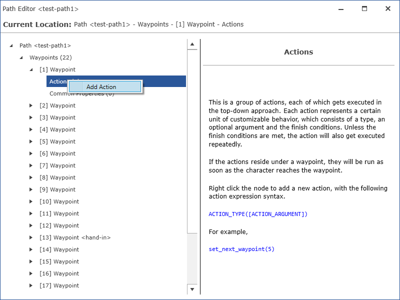

[Back to Top](#home)

### COMMON PROPERTY

`Common Properties` are "common" key-value pairs applicable to all navigation granularity levels ([Path Group](#path-group), [Path](#path) and [Waypoint](#waypoint)), specifying an aspect of character behavior while the character is running toward the [Waypoint](#waypoint) (Next Waypoint) with it, in terms of movement, combat, interaction, recovery, and etc. An important feature about them is "inheritance". That is to say `Common Properties` defined in higher levels apply to all the inner lower scopes. It also means that you can redefine the same property (of the same name) in those inner lower scopes to override the inherited property values.

For example, if you define a property "A" with value "a" on a [Path Group](#path-group), all its [Paths](#path) and the [Waypoints](#waypoint) get applied as well. In this way, you save the trouble to define properties for each [Waypoint](#waypoint) one by one. Meanwhile, if you define the same property "A" with a different value "b" on one of the inner [Waypoints](#waypoint), it overrides the inherited value "a" from the parent for that [Waypoint](#waypoint).

In order to define a `Common Property`, choose the navigation unit first and then right click `Common Properties` under it. The framework has provided a bunch of built-in `Common Properties`, which can be found in [Framework Volcabulary](https://docs.google.com/spreadsheets/d/1dzurAMgAs0RuRevQZHptpJVQYJFBKb9_gyHsLMS-Wuw). Unlike actions, you can't extend `Common Properties` programatically as they are heavily interwoven with the framework.

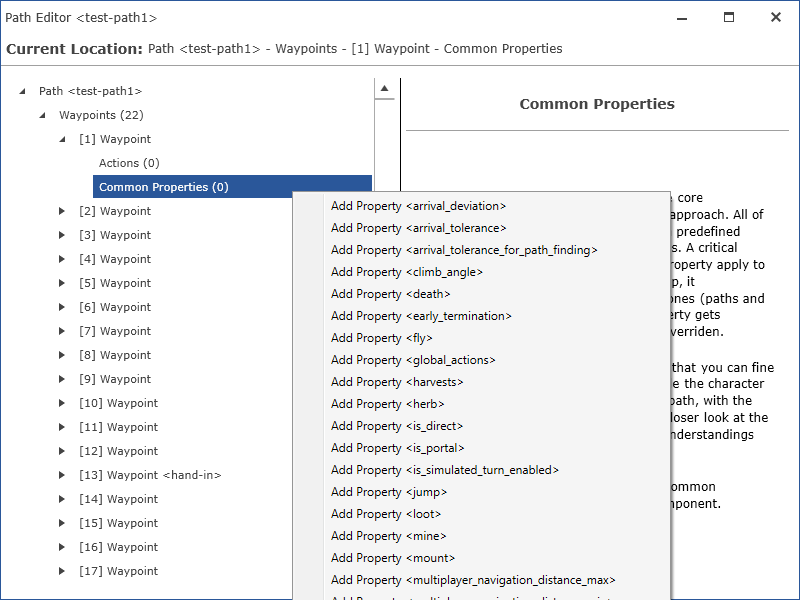

[Back to Top](#home)

### GLOBAL ACTION

A special [Common Property](#common-property) is worth mentioning separately here: `Global Action`. Similar as [Waypoint Action](#waypoint-action), it is just another type of action executable at any time within the application scope of the [Common Property](#common-property), with optionally conditions defined. The difference is `Global Actions` are evaluated and executed at every frame before other behaviors. And if the conditions check, the character will pause the other normal behaviors overridden by executing the `Global Action`.

[Back to Top](#home)

### CONDITION and VARIABLE

You have seen `Condition` for several times, including for [Next Path Group](#next-path-group), [Waypoint Action](#waypoint-action) and [Global Action](#global-action). Essentially they share the same Lua/Javascript syntax structure, consisting of a sequence of simple condition expressions (`<VARIABLE><OPERATOR><CONSTANT>`) evaluating to boolean values. A `Variable` is just a string that is evaluated by Framework to a value. An `Operator` can be one of the following: `> < >= <= = ~=`. A `Constant` can be a boolean (`true` or `false`), number (`1`, `2.3`, `-0.5`, etc) or a string (`"hello"`). A full example of condition expression is: `myself.health > 10`, evaluating to true if my own health percentage is larger than 10%.

`Conditions` (aka condition group) is the combination of a bunch of condition expressions, with either `and` or `or` to connect. The framework has also provided a bunch of built-in `Variables`, which can be found in [Framework Volcabulary](https://docs.google.com/spreadsheets/d/1dzurAMgAs0RuRevQZHptpJVQYJFBKb9_gyHsLMS-Wuw). Compared with programming language such as Lua or Javascript, there are a couple of limitations such as limited operators and only one level of combination supported. However, this can be easily mitigated by programatically extending your custom variables written in Lua.

[Back to Top](#home)

### CUSTOM SCRIPT

We have made "code-less" development of Bot project becomes true, but we never sacrifice the programming needs. On the contrary, we allow Lua script programming no less than pure WoW AddOns. A [Project](#project) can have one or several `Custom Scripts` attached, which are essentially Lua script files created under the project folder. The script files work very similar as normal WoW AddOn script files, loaded/executed once when the project is loaded right after the world is entered.

If this is it, the result would be not quite interesting. In fact, another main feature about such `Custom Scripts` is that the framework also looks at the return value of each script file. If it is Lua table and follows a predefined syntax, the framework will load the `custom actions`, `custom variables`, `custom settings`, and most importantly the `custom rotation` required for `pve` and `pvp` [Common Properties](#common-property) within. An example about the general structure of the table is given below:

```lua
return {
  -- Define custom actions.
  actions = {
    ["battle_test"] = function(env, arg)
      print("This is a test action with argument:", arg);
      -- Mark as completed always to make sure the action is executed only once, or the navigation will get stuck here :)
      return true;
    end,
    ["battle_leave"] = function(env, arg)
      -- env is a special container table with useful utilities, one of which is "evaluate_variable" to get the value of a variable.
      if (env:evaluate_variable("battleground") == 4) then
        print("The battleground has ended!");
        -- Another utility is "execute_action" to execute an action.
        env:execute_action("leave_battleground");
      else
        print("The battleground is still ongoing!");
      end
      return true;
    end
  },
  -- Define custom variables.
  variables = {
    ["battle.is_long_enough"] = function(env)
      -- You can use [setting.xxx] syntax to access the current value of a custom setting in terms of a variable.
      local battle_timeout = env:evaluate_variable("setting.battle_timeout");
      if (battle_timeout) then
          local battle_duration = env:evaluate_variable("battleground.duration");
          return battle_duration and battle_duration > battle_timeout or false;
      else
          return false;
      end
    end
  },
  -- Define custom settings.
  settings = {
    ["battle_timeout"] = {
      -- The name displayed on panel.
      display_name = "Battle Timeout",
      -- The mouseover tooltip.
      description = "Configure the timeout of each battle, in seconds. After the duration of a battleground exceeds the value, quit the battleground.",
      -- Whether the setting has a toggle switch.
      can_enable_disable = true,
      -- The default state of the toggle switch.
      is_enabled_by_default = true,
      -- The type of the setting, can be "number" or "string".
      type = "number",
      -- The optional values for dropdown (table). nil for textbox.
      options = nil,
      -- The width of the input box, in pixels.
      width = 100,
      -- The default value of the setting.
      default = 7200,
      -- The constraint for the input box, can be "percentage", "non_negative_number", "non_negative_integer", "positive_number" or "positive_integer"
      constraint = "non_negative_integer",
    }
  },
  -- Define rotation.
  rotations = {
    combat = function(env, is_pulling)
      -- called when a target unit is selected to engage.
    end,
    prepare = function(env)
      -- called to check and run the preparation rotation, such as summon and feeding pets, buffing, conjuring and etc.
      -- Return true if preparation is still ongoing.
      return false;
    end,
  }
};
```

Notice that you don't have to return the above table as a protocol. In this way, it is nothing different from an AddOn script but it still carries the benefits of developing under the framework, such as encryption and authorization controls!

In order to add a `Custom Script`, simply expand the [Project](#project) node in `MiniBot Studio` and right click `Custom Scripts`. Then you can use any Text Editor to edit the script file.

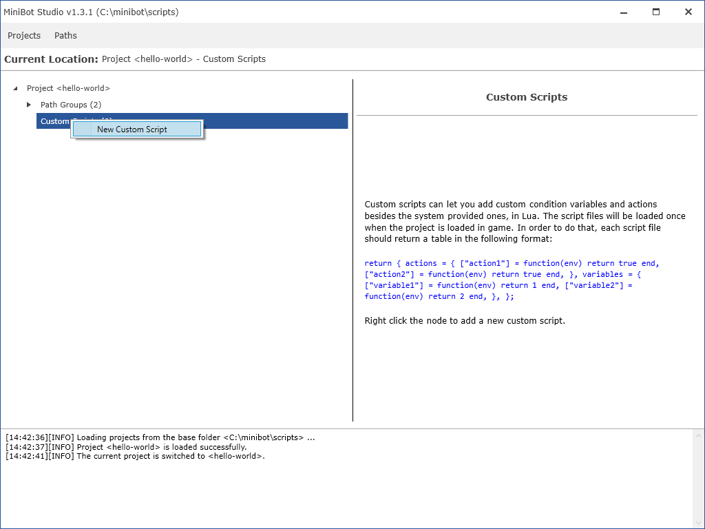

[Back to Top](#home)

### NAVIGATION STATES

So far, we have covered most concepts from the design side. However, when it comes to runtime side, you will see the `States` category on the in-game panel, in which all framework states are listed, maintained and persisted. It is a perfect design for saving the "current navigation states". No matter when you stop/quit the Bot, you can also resume the project later from the exact same point.

Consider `Navigation States` a bridge between the project developer and user. While the framework autonomously updates the state fields on the panel, the user can also modify them for better flexibility before clicking `Start`. It becomes quite handy if the user wishes to report something about any point of a project, with the current `Navigation States` to the project developer. This is also a very useful zone for developers to see how the framework runs on the fly, for better understanding and digestion of the above concepts.

[Back to Top](#home)

## YOUR FIRST SIMPLE GRIND PROJECT

If you are familiar with the concepts above, it is time to get your hands dirty. If you are still confused with any concept, feel free to jump back and forth. In this section, we are going to build your first Bot project: `SIMPLE GRIND`. The goal is to farm mobs and resources in an open world area. Besides, the character should also be able to return to town for vendoring and replenishment, to make the cycle fully autonomous!

### START MINIBOT STUDIO

Follow the steps in [Start as a Project Developer](#start-as-a-project-developer) to download and open `MiniBot Studio`. It is recommended to choose the `scripts` folder as the base and click "Start Now".

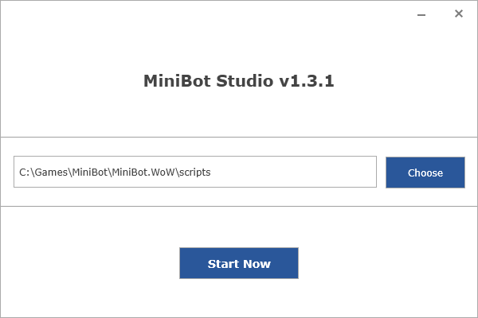

[Back to Top](#home)

### CREATE NEW PROJECT

To begin with, choose "Projects" - "New", and enter "simple-grind" as the name of your new project for this example. We will use the birthplace map of dwarves "Dun Morg" on WoW Classic to complete the example project.

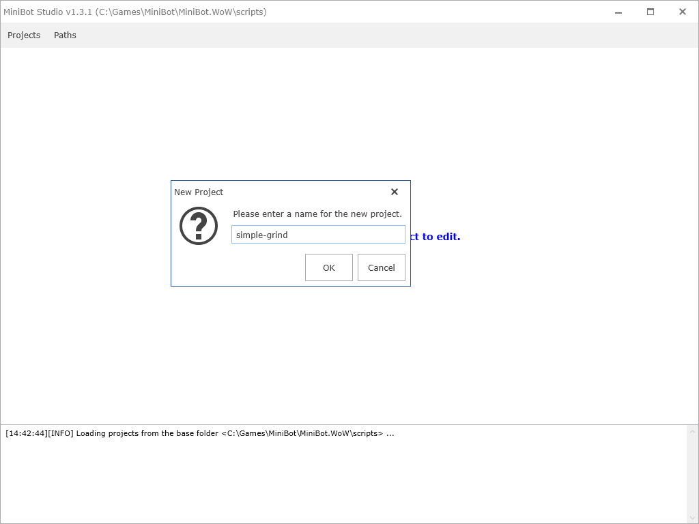

It is also the right time to explore the project structure in `MiniBot Studio`. Make sure you have chosen the new project as the current one ("Projects" - "Current") and then you should see the tree structure in the left pane. Expand the tree nodes and you should see the relevant editor for each node on the right pane. Also notice that any changes you made are saved on the fly (no explicit save is required), and are also logged in the bottom text window.

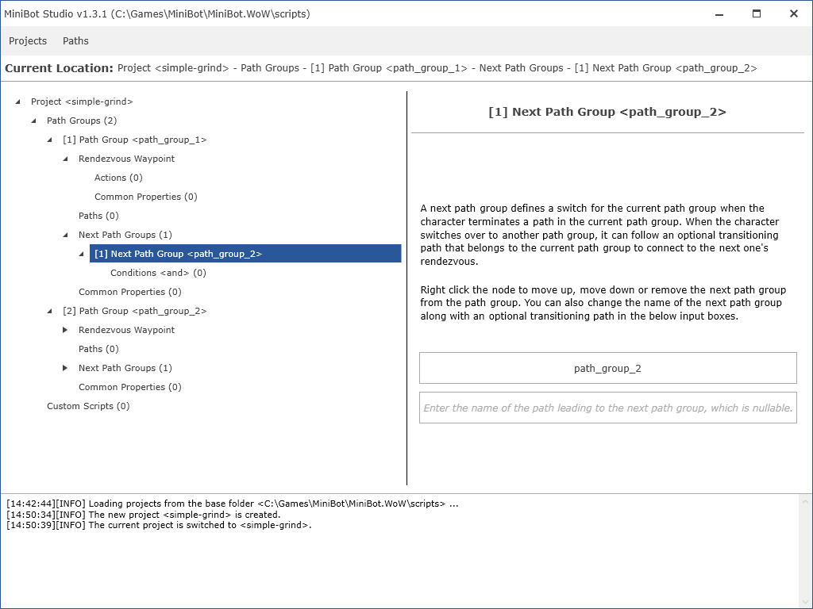

### DESIGN PROJECT TOPOLOGY

A good grinding bot should start from a clear design of project topology. The goal of the project can be splitted into grinding mobs and resources in the outer world, and vendoring and replenishment in the town area. So here comes the visualization of the project topology.

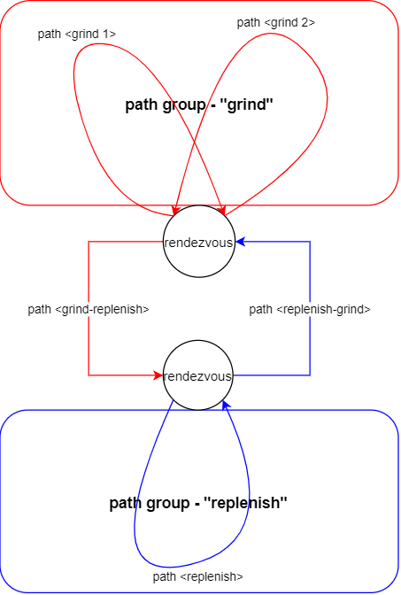

Notice the red arrow lines represent the [Paths](#path) of [Path Group](#path-group) `grind` while the blue arrow ones represent the [Paths](#path) of [Path Group](#path-group) `replenish`.

[Back to Top](#home)

### CREATE PATH GROUPS

With the conceptual topology in mind, it is time to return to `MiniBot Studio` to implement the [Path Groups](#path-group) shown above. [Path Group](#path-group) `grind` should cover the "grinding zone" and [Path Group](#path-group) `replenish` should cover the "town zone".

You could reuse the existing default [Path Groups](#path-group) from the new project, or delete them all for good and re-create them. We shall take the second approach here. Remember to press "Enter" when you finish typing the value in the right pane editor. Right click `Path Groups` under the project node and choose "Create Path Group". In addition, define the [Next Path Group](#next-path-group) for each of them as illustrated in the above topology, and you should have the following result.

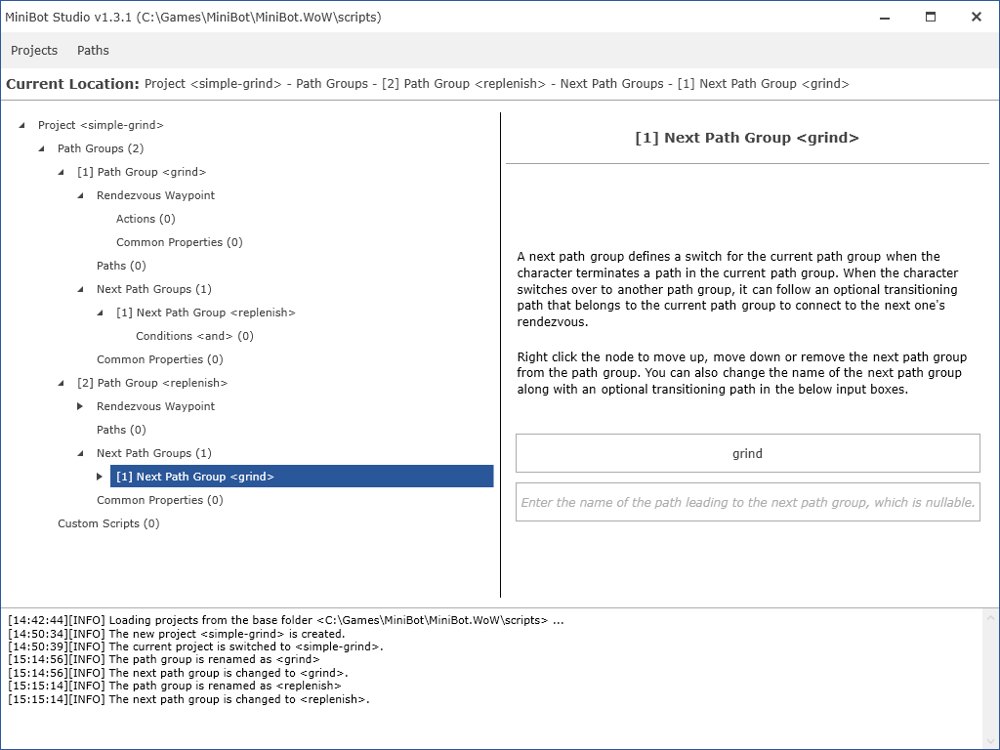

So far, the [Next Path Groups](#next-path-group) do not have any conditions so the first one will be taken unconditionally after a [Path](#path) is terminated in the current [Path Group](#path-group), which is undesirable. Instead, we need to add the conditions to indicate that:

- The [Path Group](#path-group) `grind` should be switched to `replenish` only when inventory is full or the equipment durability is low. So right click the "Conditions" under the [Next Path Group](#next-path-group) `replenish`, add the [Conditions](#condition-and-variable) as below.
  
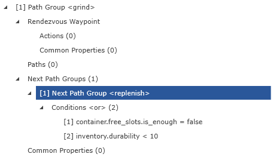
  
- The [Path Group](#path-group) `replenish` should be switched back to `grind` unconditionally. So no further work needs to be done here.
  
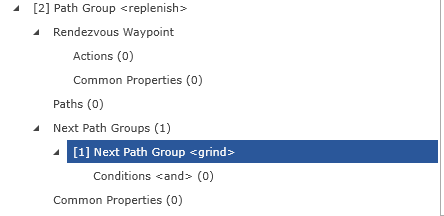
  
[Back to Top](#home)
  
### RECORD PATHS

The character won't move with empty [Path Groups](#path-group) defined above. Let's create the paths by recording them first in game. We have the following paths to record:

- grind1 & grind2

The two grind paths for grinding mobs and resources. You could add more grind paths for better randomizations!

- replenish

The single replenish path for vendoring and replenishment.

- grind-replenish

The transitioning path to lead the character from the rendezvous of grinding zone to the rendezvous of town zone. It is not necessary here but serves as an example.

- replenish-grind

Same as above in the reverse way.

Firstly, make sure you choose "Development" mode for the Primary Engine of the in-game panel.

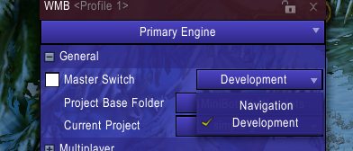

Secondly, create the following development macros needed for path recording. To check the full list of available recording and other development macros, navigate to the bottom of the panel and check the category "Dev". Don't forget to start the Bot before using the macros.

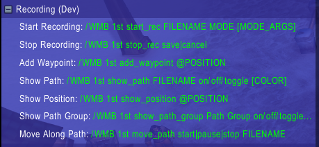

- NEW: `/wmb 1st start_rec grind1 2`
  
Start a new recording of a path in the current project, named "grind1".
  
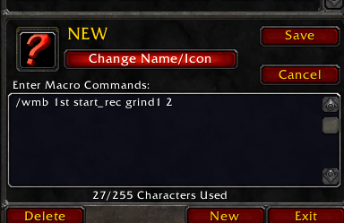
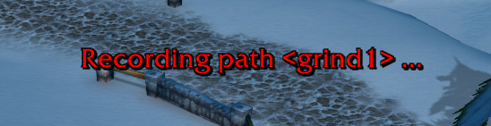
  
- ADD_WP: `/wmb 1st add_waypoint @player`
  
Add a waypoint at the location of the character to the end of the current path being recorded.
  
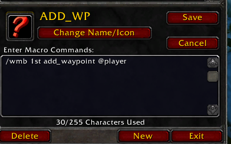
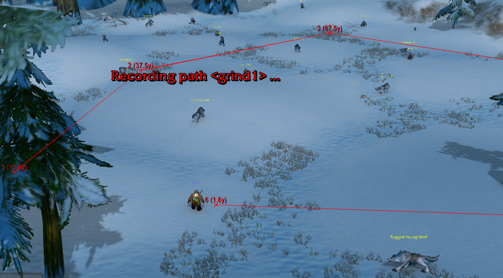
  
- SAVE: `/wmb 1st stop_rec save`
  
Finish the recording and save the path to a file in the current project folder.

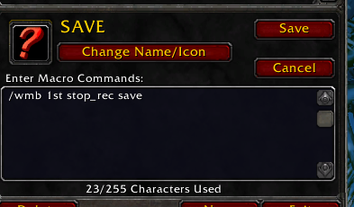
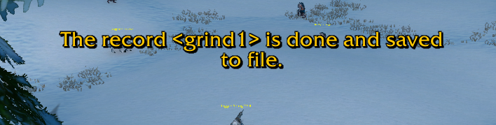
  
- CANCEL: `/wmb 1st stop_rec cancel`
  
Cancel the recording.

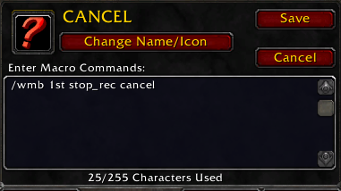
  
- POS: `/wmb 1st show_position @player`
  
Show the current position of the character for copy-paste. This is useful for modifying the co-ordinates later, including [Rendezvous](#redezvous).

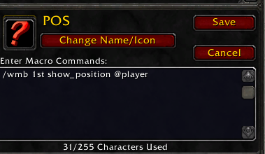
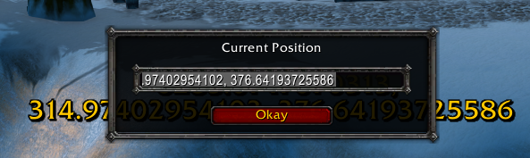

Remember to repeat the above steps for recording all the paths needed, according to the [Topology](#design-project-topology). And when all paths are recorded, restart `MiniBot Studio` and you should see the new paths in the "Paths" menu.

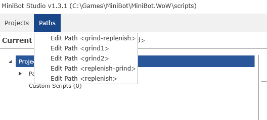
  
[Back to Top](#home)

### ASSIGN PATHS TO PATH GROUPS

For now, all paths recorded are owner-less. We need to assign them to the relevant [Path Groups](#path-group) or [Next Path Groups](#next-path-group).

In `MiniBot Studio`, choose "Paths" under the [Path Group](#path-group) and right click "Add Path", followed by entering the name of the path to assign to the group. Also, check the right pane editor of the [Next Path Group](#next-path-group) and enter the name of the path to assign it as a transitioning. In the end, you should have the following paths structure.

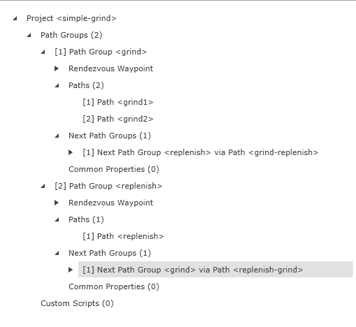

You can review the assignment result back in-game with the following macro, to show all paths in a path group in game.

- SHOW_PG: `/wmb 1st show_path_group grind toggle ff0000`

Show/Hide all paths in the path group "grind" in red color, same as the [Topology](#design-project-topology).

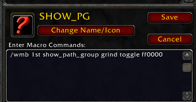
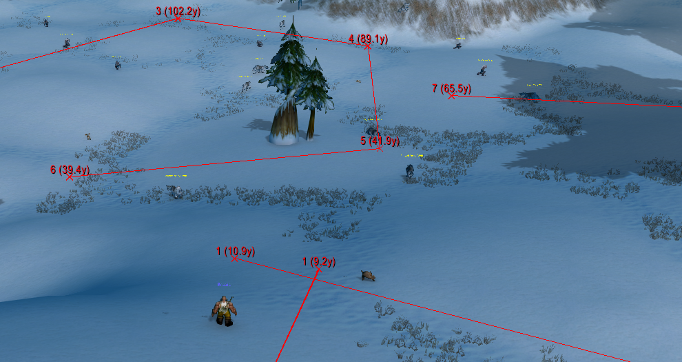

[Back to Top](#home)

### CONFIGURE RENDEZVOUS

Use the "POS" macro to record the rendezvous for both [Path Groups](#path-group). Copy and paste the co-ordinates back to the corresponding [Path Group](#path-group) in "MiniBot Studio" as below.

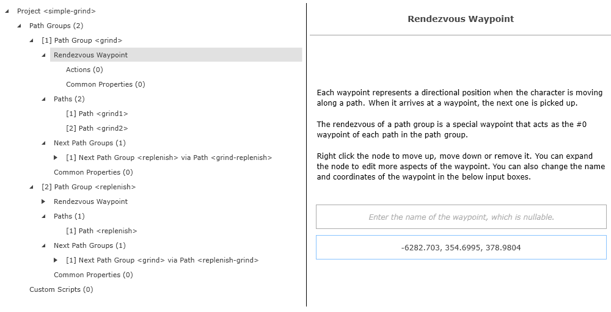

Till here, you have finished all the in-game recording work, visualized as below. You can even start a test navigation in game, and you shall see the character will move along the paths as you just recorded.

Path Group "grind":

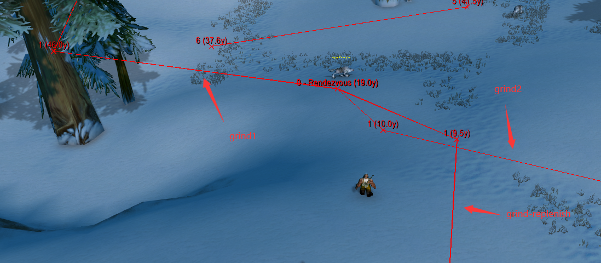

Path Group "replenish":

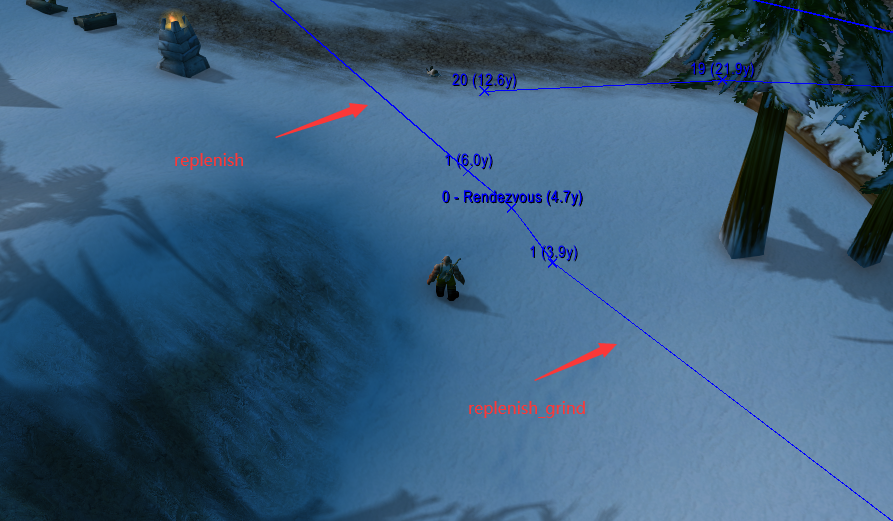
  
[Back to Top](#home)

### ADD COMMON PROPERTIES

For general behaviors other than normal navigation, such as combat and loot, you need to add [Common Properties](#common-property), including `pve`, `pvp`, `loot`, `skin`, `herb`, `mine`, `treasure`, and `harvest`. For details of these properties, you could refer to their documentations listed on `MiniBot Studio` or [Framework Volcabulary](https://docs.google.com/spreadsheets/d/1dzurAMgAs0RuRevQZHptpJVQYJFBKb9_gyHsLMS-Wuw). In this example, we will cover only two of them here, while the others follow the similar pattern.

- `pve` for Grinding Mobs

Without the [Common Property](#common-property) `pve`, the character won't engage with any mobs. Simply add it to the path `grind1` and `grind2` so while the character is moving along both paths, it will look for mobs on the fly and kill them.

The active combat behavior (aka "attack") is part 1 of `pve`. Use it when you wish the character to attack the mobs in an active way. Notice that you need to specify the search ranges and mob types (ID) if necessary. For mob IDs, you could use Magic Vision in our provided `Secondary Engine` or any other ID AddOns to find them. Besides, you could specify the attack range between the character and the mob. This will override the user's relevant panel setting. Last but not least, You can also specify [Conditions](#condition-and-variable) for each attack definition, which will be evaluated every frame during the application scope of `pve`.

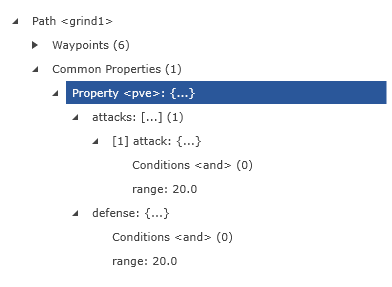

The passive combat behavior is part 2 of `pve`. Use it when you wish the character to defensive if an unwanted aggro is pulled. You can also define one or more attacks, ordered by priority.

- Combat Rotation for `pve`

The character still won't engage the mob without a valid `Combat Rotation` defined. This is only doable via a [Custom Script](#custom-script). Yes, unfortunately, you need to write Lua for this. We don't offer any pre-packed standard CR logics, as they are prone to change and highly customizable. However, there are several degrees to do this, from easy ones to harder ones. We will cover them here.

No matter which way to choose, the first step is to create a [Custom Script](#custom-script) as below.

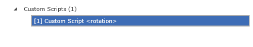

Then, edit the script file with the following code, which contains the simplest logics as a level 1 Warrior to kill a mob.

```lua
return {
  -- Define rotation.
  rotations = {
    combat = function(env, is_pulling)
      -- called when a target unit is selected to engage.
      if (UnitExists("target")) then
        RunMacroText("/startattack");
        if (UnitPower("player") > 15) then
          RunMacroText("/cast Heroic Strike");
        end
      end
    end,
    prepare = function(env)
      -- called to check and run the preparation rotation, such as summoning and feeding pets, buffing, conjuring and etc.
      -- Return true if preparation is still ongoing.
      return false;
    end,
  }
};
```

Go back to game (reload first), make sure you have adjusted the right combat parameters on panel, including the combat ranges! So, not that hard, is it?

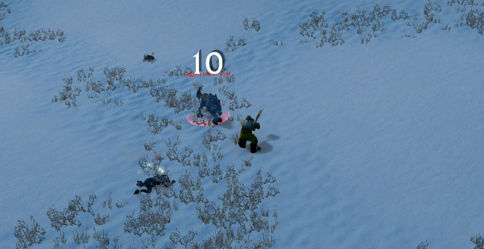

However, it still becomes tedious if you wish to take care of all classes and specs in WoW by hand writing pure Lua codes. Don't worry, we suggest you could utilize some popular rotation AddOn, such as [GSE](https://www.curseforge.com/wow/addons/gse-gnome-sequencer-enhanced-advanced-macros). In this way, you can simply let users create macros in GSE with a specific name, and call that macro with a simple [RunMacro](https://wow.gamepedia.com/API_RunMacro) function call. As there are lots of GSE resources on the web, it is a piece of cake to setup the CR logics.

- `loot` for Looting

You need to add another [Common Property](#common-property) `loot` for looting dead mobs. We won't repeat the nuts and bolts here similar as `pve`, simply as below.

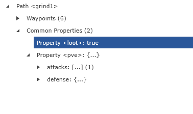
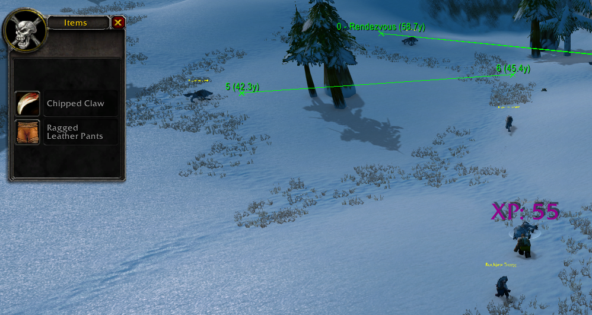

- `skin` for Skinning

Skinning the dead units is another [Common Property](#common-property), similar as `loot`. Define it if you need the character to skin the mobs if they are skinnable. In this example, we won't cover the usage here.

- `herb`, `mine` and `treasure`

When it comes to herbs, ores and chests, the framework has provided these 3 built-in [Common Properties](#common-property) as well. It is essentially working on "Game Objects" via filtering the model IDs. As a result, we only support these 3 properties on WoW Classic (no Retail support). Don't worry, simply use `harvest` if you wish to do these things on WoW Retail. In this example, we won't cover the usage here.

- `harvest`

If you wish to "interact-and-loot" any unclassified "Game Objects", just add `harvest` [Common Properties](#common-property) that requires you to specify the model IDs. You have to use this for all game objects on Retail and other types of game objects on Classic such as quest objectives. In this example, we won't cover the usage here.

[Back to Top](#home)

### Add Waypoint Actions

While [Common Properties](#common-property) usually describe "linear behaviors" when the character is moving along the path toward the next [Waypoint](#waypoint), you can define "point actions" upon arrival of a certain [Waypoint](#waypoint). In this example, this involves "selling and repairing" and "purchasing supplies" on the `replenish` path.

- Sell and Repair

The first thing when we return to the town, is to sell the junks and repair the equipments. The NPC that is going to interact with for this job is near the [Waypoint](#waypoint) #7. You can use the "Secondary Engine" to grab his ID 1104, and as a good note, we rename this [Waypoint] accordingly as "sell_repair@1104".

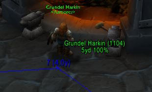

Back to `MiniBot Studio`, right click "Actions" under the [Waypoint](#waypoint) #7, add an [Waypoint Action](#waypoint-action) `interact({"id": 1104, "range": 10})`. This action will search for the NPC (with ID 1104 within 10 yards), move close enough if found, and interact with it. According to [Framework Volcabulary](https://docs.google.com/spreadsheets/d/1dzurAMgAs0RuRevQZHptpJVQYJFBKb9_gyHsLMS-Wuw), the action "interact" will never return true (never complete), we need to add a precondition for it to control its completion. That is `merchant.is_open = false` (when the merchant window is not open). To recap the procedure here, we can use the following pseudo code.

```lua
while (action.conditions() == true) do
  if (action() == true) then
    break;
  end
end
```

Once the merchant window is open, the Bot will move on to the next action `sell()`. In this example, though this action returns true (is completed) when all items are sold, we still add a precondition `action.duration < 5` for it. This is mainly because we also wish to control the timeout of such action to be 5 seconds, to avoid unexpected lags. The 3rd action `repair()` is also similar, followed by 4th action `close_merchant()` as a good behavior to say goodbye before leaving.

In the end, we shall have the following [Waypoint Action](#waypoint-action) design.

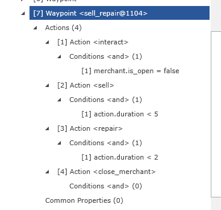

- Purchase Supplies

The framework has a built-in simple module to purchase foods, drinks and ammos (for Classic only). Users can configure the purchase behavior on the panel while the project developer only needs to worry about the NPC interaction. The NPC (ID=829) for this job is near [Waypoint](#waypoint) #17, renamed as "purchase_supplies@829". Do the following action design similar as above, of which the only difference is a new action `replenish()`.

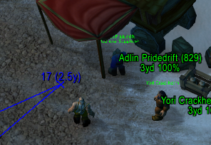
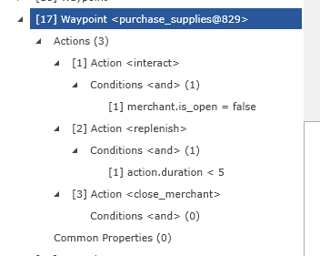

[Back to Top](#home)

### Finalize &amp; Publish

Contragulations! You have finished your first project: Simple Grind! Switch the master switch setting to "Navigation" mode and give it a try. The full source code of the example project can be downloaded from [here](https://github.com/pierre-picard/minibot-wow/tree/master/examples/simple-grind). You can also watch our pre-recorded run from below.

[](https://youtu.be/nh42ssQU5hs)

You must now want to share your project work with others. This is extremely simple. Remember that the project is just a single folder, similar as a WoW AddOn. So just go to your project folder and send it to another one, just as you can download the example project from above.

Wait, what if I don't want to share the source code to get copyright protected? Don't worry! as discussed in [Seller and Reseller](#start-as-a-project-seller-or-minibot-reseller), you can utilize `MiniBot CLI` to compile your project source code into an encrypted copy. Moreover, it also allows you to add authorization control into the compiled copy in terms of MiniBot nicknames, expiry dates, maximum allowed sessions, and whether to hide running details from the end user. In this section, we will guide you through the usage of `MiniBot CLI`.

- Download `MiniBot CLI`

Go to [Releases](https://github.com/pierre-picard/minibot-wow/releases/latest) and download `MiniBot.WoW.CLI.zip`. You can actually just place the EXE file in the same folder as GUI version so they can share the same folder structure.

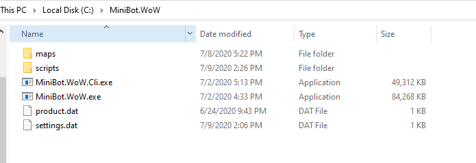

- Open Command Prompt and Check Help

Enter the command

```
MiniBot.WoW.Cli.exe --help
```

to see the following verbs. If you wish to use the inject function, remember to grant Administrator privilege.

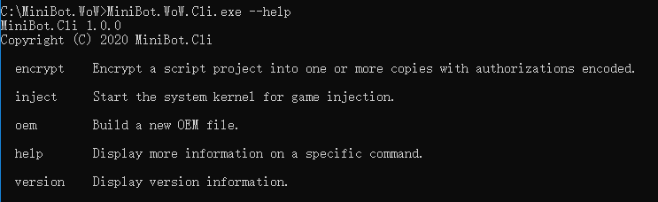

Now enter the command

```
MiniBot.WoW.Cli.exe encrypt --help
```

You should see the parameters for the `encrypt` verb.

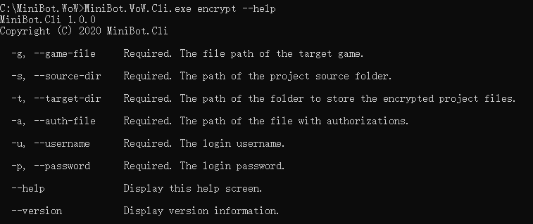

- Prepare Authorizations

You also need to prepare a separate JSON file that contains authorizations, the template of which can be downloaded from [here](cli/auth.json). You can modify it and add more authorizations needed. Also, you can omit any one of the 4 authorization dimensions, to create "unlimited access". Ultimately, if it is an empty JSON array, the result will be an encrypted but free copy.

Lastly, just place the edited `auth.json` file in the root program folder.

- Run Command

Now enter the command:

```
MiniBot.WoW.Cli.exe encrypt --username [login username] --password [login password] --game-file "C:\Program Files\Battle.net\World of Warcraft\_classic_\WowClassic.exe" --source-dir "C:\minibot.wow\scripts\simple-grind" --target-dir "C:\minibot.wow\scripts" --auth-file "C:\minibot.wow\auth.json"
```

Remember to replace the arguments to suit your PC. If everything checks fine, you should see the following result with the compiled file saved in target folder, which can be published to others.


The compiled project file (xxx.bot) is nothing different from a source project folder, which will be loaded side by side into game. The only difference is that you can't live update the compiled project files as source project folders, so that you have to restart WoW in order to update them.

[Back to Top](#home)

## BUILD YOUR OWN FRAMEWORK &amp; ADDON

This is an advanced topic for those real Lua gurus. In fact, this is the way and the only way that other "unlockers" in the market provide. Of course, we also don't limit any possibilities in this area. You are fully capable to create your own framework or WoW addon with the unlocking feature and API set brought by `MiniBot for WoW`, in pure Lua.

If you still wish to build your own logics on top of our development framework, you can still create [Project](#project) with primary focus on the [Custom Scripts](#CUSTOM-SCRIPT) part. Notice that all [Custom Scripts](#CUSTOM-SCRIPT) get loaded in the first beginning (the same time when MiniBot Development Framework is loaded), so this is quite similar as a normal WoW addon lua file. However, you can enjoy the full benefits of [Project](#project), including UI panel settings and encryption with authorization controls!

If you don't like our development framework at all, you can fully build your own pure WoW addon. And what `MiniBot` offers is fully-featured unlocker, described below.

### Unlock Protected WoW API

Here is the [list](https://wow.gamepedia.com/Category:API_functions/Protected) of all protected official WoW API. Now with `MiniBot` launched, all of them are free for use without any trouble!

[Back to Top](#home)

### Universal Object ID

[UnitId](https://wow.gamepedia.com/UnitId) is a special type of string argument used by many WoW API. It is heavily limited by the game system in many cases. So `MiniBot` engine extends a new type of an universal `ObjectId` returned from a series of custom API, that represents any object in the game, which can be passed as the argument for any WoW API parameter that takes [UnitId](https://wow.gamepedia.com/UnitId).

[Back to Top](#home)

### Custom API

This is the up-to-date list of `MiniBot` custom API, classified into 3 categories according to their lifecycles:

1. Common<br />
The functions that always exist in both GLUE and World.
2. In-World<br />
The functions that only exist in-world.
3. GLUE<br />
The functions that only exist in GLUE screens.

All of the custom API below are registered in a specific global table `wmbapi` if the client is not OEM. Otherwise, the table name becomes `[MACRO]api`, such as "abcapi" if your OEM short name is "abc". Remember to refer back to this from time to time as the API may change in future.

Before diving into the list, last but not least, we **DO NOT** provide intensive support for the API set. Questions such as "hey, what does API XXX mean?" will be ignored. Please help yourself if you decide to utilize them for your own good.

[Back to Top](#home)

#### Common (Arguments)

- `path = GetAppStorageDirectory()`

Gets the base directory path of app storage.

- `path = GetAppDirectory()`

Gets the app base directory path.

- `path = GetWoWDirectory()`

Gets the WoW base directory path.

[Back to Top](#home)

#### Common (File)

- `isOrNot = FileExists(path)`

Checks if a file exists.

- `text = ReadFile(path)`

Reads all text from a file.

- `success = WriteFile(path, text[, append])`

Writes all text to a file.

- `isOrNot = DirectoryExists(path)`

Checks if a directory exists.

- `success = CreateDirectory(path)`

Creates a directory.

- `fileNames = GetDirectoryFiles(path)`

Gets all file names in a specific directory.

- `folderNames = GetDirectoryFolders(path)`

Gets all sub folder names in a specific directory.

[Back to Top](#home)

#### Common (Maths)

- `centers = GetAllSpanningCircles(radius, minWeight, points)`

Gets all spanning circles of a specific radius over certain weighted points.

[Back to Top](#home)

#### Common (Miscellanea)

- `down, toggled = GetKeyState(key)`

Gets the pressed state of a specific key.

- `success = PlaySoundFile(path)`

Plays a specific sound WAV/MP3 file once.

- `SetCustomScript(name, script)`

Add a custom script (indexed by name) that gets loaded side by side with the engine modules (Primary and Secondary). Notice that such script also gets loaded in GLUE screen.

[Back to Top](#home)

#### In-World (State)

- `ResetAfk()`

Resets the timer for AFK.

[Back to Top](#home)

#### In-World (Action)

- `ClickPosition(x, y, z[, right])`

Clicks a world position.

- `FaceDirection(angle[, update])`

Faces a horizontal direction, in radian.

- `SetPitch(angle)`

Sets the player vertical pitch, in radian.

- `MoveTo(x, y, z[, instantTurn])`

Moves the player to a specific position, using CTM.

[Back to Top](#home)

#### In-World (Missile)

- `count = GetMissileCount()`

Gets the count of the flying missiles.

- `spellId, spellVisualId, x, y, z, sourceObject, sourceX, sourceY, sourceZ, targetObject, targetX, targetY, targetZ = GetMissileWithIndex(index)`

Gets the info of a specific missile.

[Back to Top](#home)

#### In-World (Navigation)

- `mapId, zoneId = GetCurrentMapInfo()`

Gets the map information about the current location.

- `success = LoadMap(mapId)`

Loads a navigation map.

- `success = UnloadMap(mapId)`

Unloads a navigation map.

- `isOrNot = IsMapLoaded(mapId)`

Checks if a navigation map is loaded.

- `path = FindPath(mapId, x1, y1, z1, x2, y2, z2)`

Calculates a path to navigate from one position to another.

[Back to Top](#home)

#### In-World (Object-Constants)

- `types = GetValueTypesTable()`

Gets the table that contains all object descriptor value types.

- `flags = GetObjectTypeFlagsTable()`

Gets the table that contains all type flags.

- `fields = GetObjectFieldsTable()`

Gets the table that contains all object field offsets.

- `descriptors = GetObjectDescriptorsTable()`

Gets the table that contains all object descriptor offsets.

- `movementFlags = GetUnitMovementFlagsTable()`

Gets the table that contains all unit movement flags.

[Back to Top](#home)

#### In-World (Object-General)

- `object = GetObjectWithGUID(guid)`

Gets the object by its GUID.

- `flags = ObjectTypeFlags(object)`

Gets the type flags of an object.

- `isOrNot = ObjectIsType(object, type)`

Checks if an object is of specific type.

- `isOrNot = ObjectExists(object)`

Checks whether an object exists in memory.

- `x, y, z = ObjectPosition(object)`

Gets the world position of an object.

- `facing = ObjectFacing(object)`

Gets the horizontal rotation of an object, in radian.

- `distance = GetDistanceBetweenObjects(object1, object2)`

Gets the distance between two objects in 3D.

- `facing, pitch = GetAnglesBetweenObjects(object1, object2)`

Gets the angles (facing & pitch) between two objects.

- `isOrNot = ObjectIsFacing(object1, object2[, tolerance = PI/2])`

Checks if an object is facing another object.

- `isOrNot = ObjectIsBehind(object1, object2)`

Checks if an object is behind another object.

[Back to Top](#home)

#### In-World (Object-Descriptor)

- `value = ObjectDescriptor(object, offset, type)`

Gets a descriptor value of an object.

- `scale = ObjectScale(object)`

Gets the scale of an object.

- `dynamicFlags = ObjectDynamicFlags(object)`

Gets the dynamic flags of an object.

- `creator = UnitCreator(object)`

Gets the creator object of an object.

- `radius = UnitBoundingRadius(object)`

Gets the bounding radius of an unit.

- `reach = UnitCombatReach(object)`

Gets the combat reach of an unit.

- `target = UnitTarget(object)`

Gets the target object of an unit.

- `flags = UnitFlags(object)`

Gets the flags of an unit.

[Back to Top](#home)

#### In-World (Object-Field)

- `value = ObjectField(object, offset, type)`

Gets a field value of an object.

- `castingTarget = UnitCastingTarget(unit)`

Gets the casting target object of a unit.

- `transport = UnitTransport(unit)`

Gets the transport object of a unit.

- `pitch = UnitPitch(unit)`

Gets the vertical pitch of a unit, in radian.

- `flags = UnitMovementFlags(unit)`

Gets the movement flags of a unit, indicating its moving status.

- `value = UnitMovementField(unit, offset, type)`

Gets the field value of a unit's movement struct.

[Back to Top](#home)

#### In-World (Object-Miscellanea)

- `x, y, z = GetCorpsePosition()`

Gets the position of the corpse.

- `isOrNot = UnitIsLootable(unit)`

Gets whether a unit is lootable.

- `isOrNot = UnitIsSkinnable(unit)`

Gets whether a unit is skinnable.

- `isOrNot = UnitIsMounted(unit)`

Gets whether a unit is mounted.

[Back to Top](#home)

#### In-World (Object Manager)

- `count = GetObjectCount()`

Gets the count of all world objects.

- `object = GetObjectWithIndex(index)`

Gets a specific world object by its index.

- `count = GetNpcCount([center | x, y, z][, range][, option])`

Gets the count of specific NPCs.

- `npc = GetNpcWithIndex(index)`

Gets a specific NPC by its index.

- `count = GetPlayerCount([center | x, y, z][, range][, option])`

Gets the count of specific players.

- `player = GetPlayerWithIndex(index)`

Gets a specific player by its index.

- `count = GetGameObjectCount([center | x, y, z][, range][, option])`

Gets the count of specific game objects.

- `gameObject = GetGameObjectWithIndex(index)`

Gets a specific game object by its index.

- `count = GetDynamicObjectCount([center | x, y, z][, range][, option])`

Gets the count of specific dynamic objects.

- `dynamicObject = GetDynamicObjectWithIndex(index)`

Gets a specific dynamic object by its index.

- `count = GetAreaTriggerCount([center | x, y, z][, range][, option])`

Gets the count of specific area triggers.

- `areaTrigger = GetAreaTriggerWithIndex(index)`

Gets a specific area trigger by its index.

[Back to Top](#home)

#### In-World (Spell)

- `isOrNot = IsAoEPending()`

Checks if there is a pending spell on the cursor.

- `CancelPendingSpell()`

Cancels the pending spell on the cursor.

[Back to Top](#home)

#### In-World (Vision)

- `x, y, z = TraceLine(x1, y1, z1, x2, y2, z2, flags)`

Checks ray cast intersection from position 1 to position 2.

- `x, y, z = GetCameraPosition()`

Gets the position of the camera.

- `isOnScreen, x, y = WorldToScreen(object | x, y, z)`

Projects a world position to the screen NDC position.

- `x, y, z[, object] = ScreenToWorld(x, y)`

Projects a screen NDC position to a world object or a terrain position.

[Back to Top](#home)

#### In-World (BlackTech)

- `SetCameraDistanceMax([distance])`

Sets the current camera distance maximum. If nil, restore original setting.

- `SetClimbAngle([angle])`

Sets the engine allowed climb angle, in radian. If nil, restore original setting.

- `success = SetCVarEx(name, value)`

Sets a CVar without system limitation.

- `SetNameplateDistanceMax([distance])`

Sets the current nameplate visible distance maximum. If nil, restore original setting.

- `StopFalling()`

Stops the current falling of the character right now.

- `EnableFlyingMode(enabled)`

Enable/Disable flying mode of the character. (HINT: DO NOT enable flying while falling or you would get disconnected)

- `isFlying = IsFlyingModeEnabled()`

Gets whether flying mode is enabled for the character.

- `modes = GetNoClipModes()`

Gets the current no-clip mode flags, which is a sum of:
0: none
1: building
2: static object
4: dynamic object

- `SetNoClipModes(modes)`

Sets the current no-clip mode flags. Check the enum above.

### Framework-independent Project

MiniBot also allows you to create "framework-independent" projects which can be loaded by MiniBot directly without the AddOn framework. Such projects work like a pure WoW AddOn, except that:

1. The project is loaded in both Login screen and World.
2. The project is able to be encrypted by `MiniBot CLI`, to take the advantage of source code protection and authorization controls.

You need to manually create and edit all source code files in the project folder, including a different syntax of "project.json" as the Lua manifest file along with the Lua files to be loaded. A sample project is given [here](https://github.com/pierre-picard/minibot-wow/tree/master/examples/custom-addon).

[Back to Top](#home)
